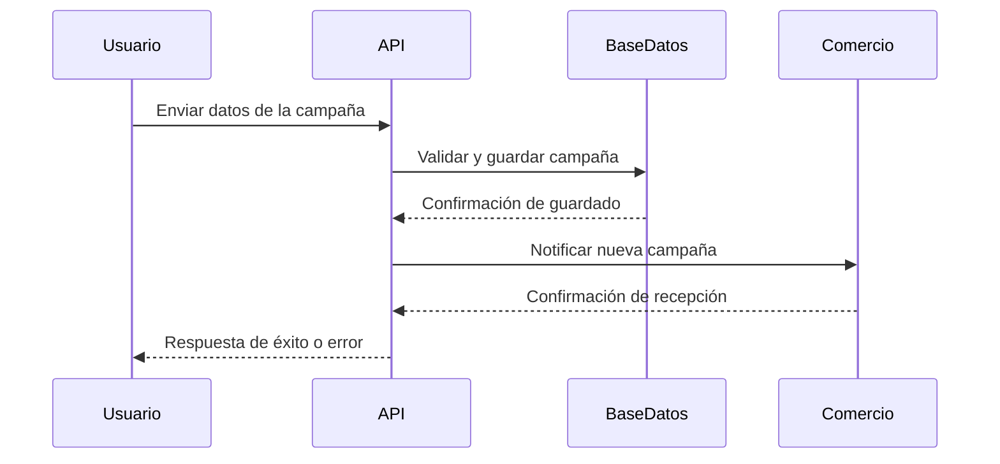
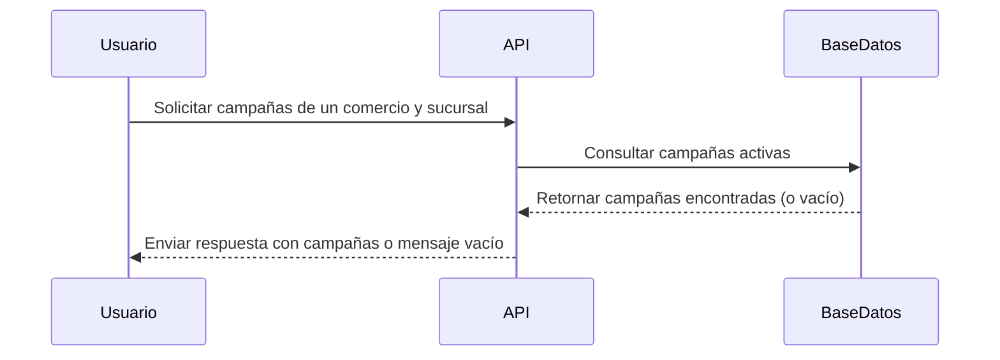
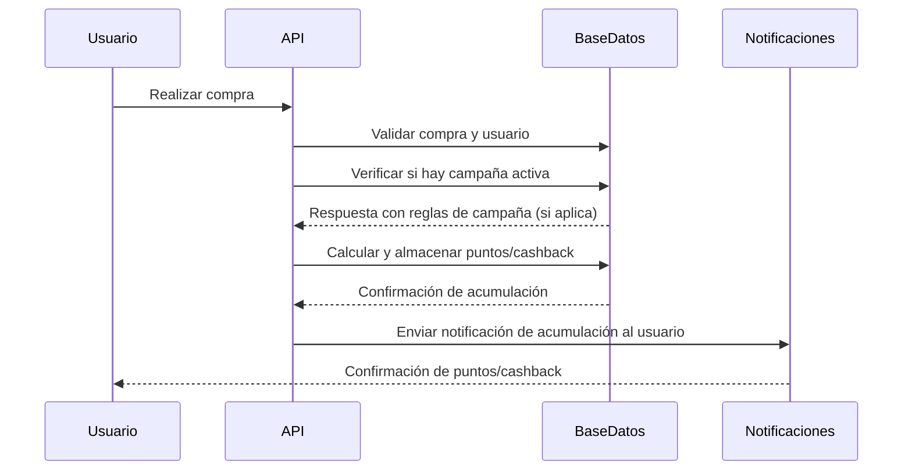
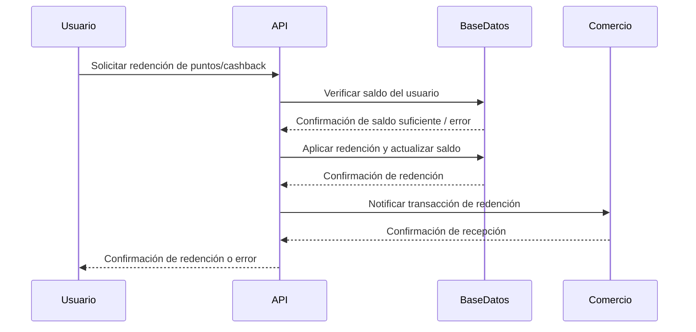

# DIAGRAMAS DE FLUJO POR CASO DE USO

## Configurar campañas para un comercio y sucursales

## Consultar campañas de un comercio y sucursal

## Realizar acumulación de puntos o cashback

## Redimir puntos o cashback en un comercio

