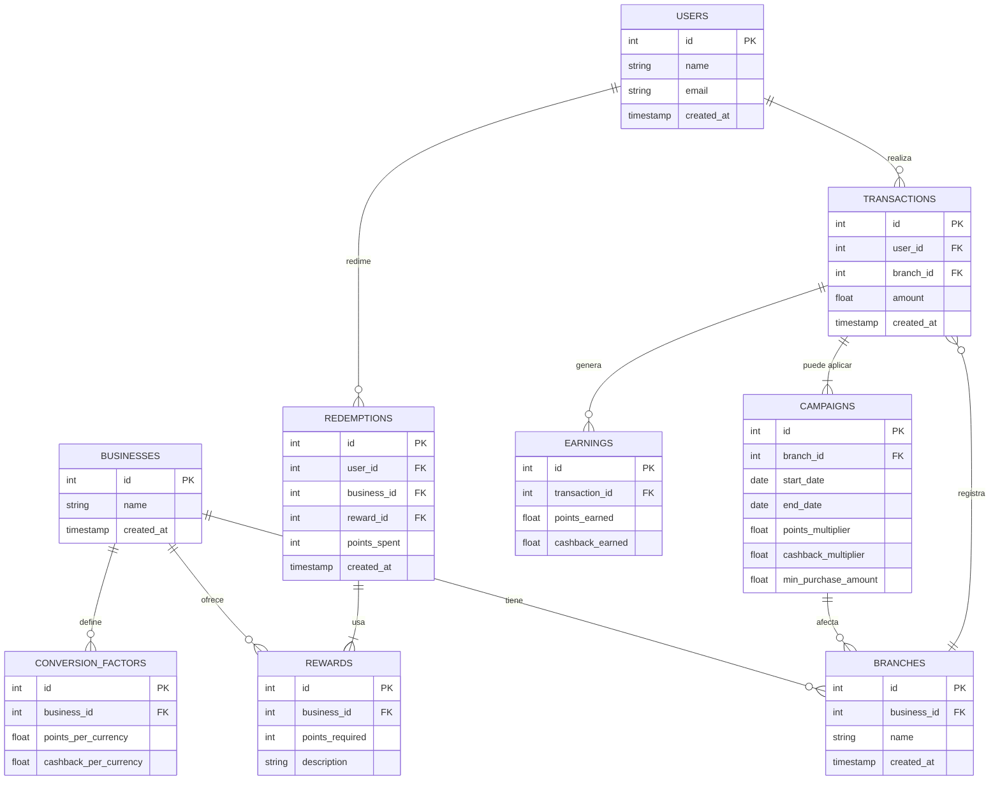

```mermaid 
erDiagram

    USERS {
        int id PK
        string name
        string email
        timestamp created_at
    }

    BUSINESSES {
        int id PK
        string name
        timestamp created_at
    }

    BRANCHES {
        int id PK
        int business_id FK
        string name
        timestamp created_at
    }

    CONVERSION_FACTORS {
        int id PK
        int business_id FK
        float points_per_currency
        float cashback_per_currency
    }

    TRANSACTIONS {
        int id PK
        int user_id FK
        int branch_id FK
        float amount
        timestamp created_at
    }

    CAMPAIGNS {
        int id PK
        int branch_id FK
        date start_date
        date end_date
        float points_multiplier
        float cashback_multiplier
        float min_purchase_amount
    }

    EARNINGS {
        int id PK
        int transaction_id FK
        float points_earned
        float cashback_earned
    }

    REWARDS {
        int id PK
        int business_id FK
        int points_required
        string description
    }

    REDEMPTIONS {
        int id PK
        int user_id FK
        int business_id FK
        int reward_id FK
        int points_spent
        timestamp created_at
    }

    USERS ||--o{ TRANSACTIONS : "realiza"
    BUSINESSES ||--o{ BRANCHES : "tiene"
    BRANCHES ||--o{ TRANSACTIONS : "registra"
    TRANSACTIONS ||--o{ EARNINGS : "genera"
    TRANSACTIONS ||--|{ CAMPAIGNS : "puede aplicar"
    BUSINESSES ||--o{ CONVERSION_FACTORS : "define"
    CAMPAIGNS ||--o{ BRANCHES : "afecta"
    USERS ||--o{ REDEMPTIONS : "redime"
    BUSINESSES ||--o{ REWARDS : "ofrece"
    REDEMPTIONS ||--|{ REWARDS : "usa"
```